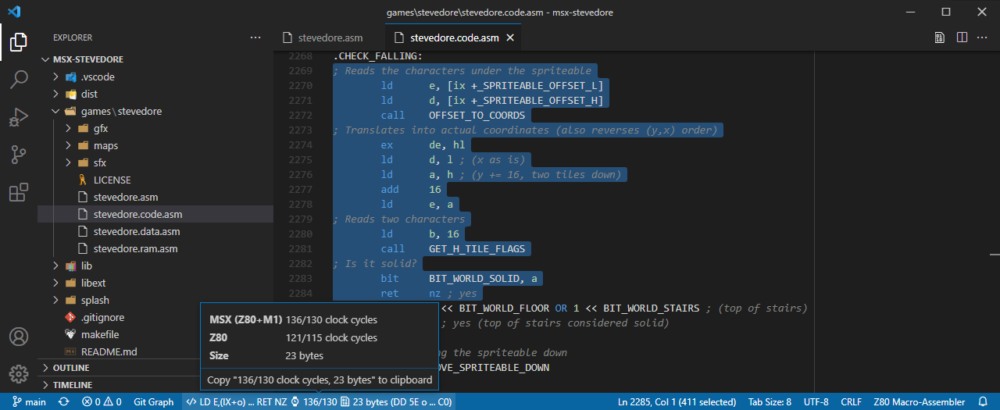
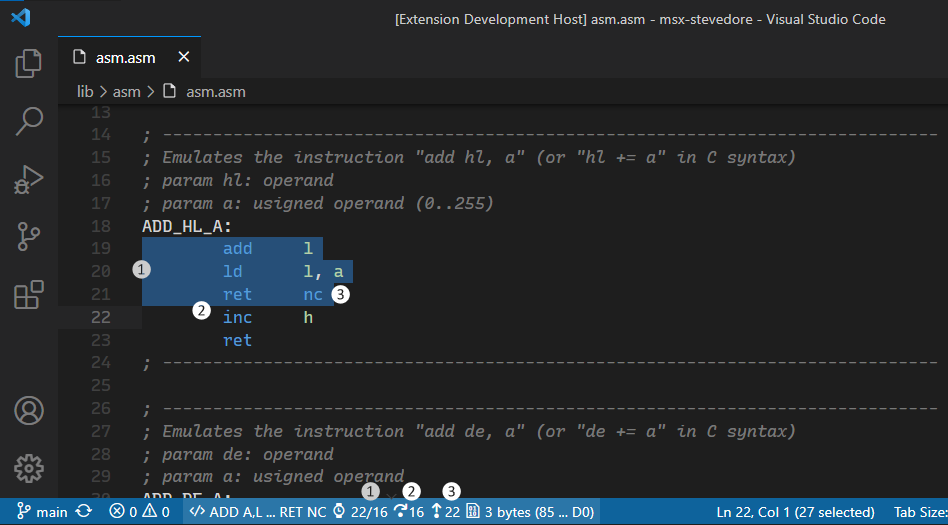

[](https://github.com/theNestruo/z80-asm-meter-vscode/actions)
[](https://www.codefactor.io/repository/github/thenestruo/z80-asm-meter-vscode/overview/master)
[](https://marketplace.visualstudio.com/items?itemName=theNestruo.z80-asm-meter)

# Z80 Assembly meter in Visual Studio Code

The **Z80 Assembly meter** extension for Visual Studio Code meters clock cycles and bytecode size from Z80 assembly source code.

This extension meters timing in Z80 clock periods, referred to as T (time) cycles.

As the MSX standard requires so-called M1 wait cycles, this extension also meters M1 wait cycles for Z80 timing calculations on MSX. For a good explanation on how to do Z80 timing calculations on MSX, please read [Wait States](http://map.grauw.nl/resources/z80instr.php#waits) from Grauw [MSX Assembly Page](http://map.grauw.nl).

In Amstrad CPC architecture, all instruction timings are stretched so that they are all multiples of a microsecond (1&nbsp;&micro;s), which is approximatively equivalent to the duration of a NOP instruction. This extension can meter duration in "number of NOPs" for timing calculations on Amstrad CPC.

ZX Spectrum Next Extended Z80 Instruction Set is supported.

<br/>

## Features

Select Z80 assembly source code to view clock cycles, mnemonic of the instruction, and/or bytecode size in the status bar. Click on either to copy the clock cycles and the bytecode size information to the clipboard.


<br>_Theme: [Dark-](https://marketplace.visualstudio.com/items?itemName=theNestruo.dark-minus-theme)_

If there is no selection, the current line will be used.

<br/>

## Recommendations

This extension can be installed standalone, but does not contribute any problem matcher, symbol provider, definition provider, or completion proproser for Z80 assembly.

Therefore, it is recommended to install this extension alongside other Z80-related extensions, such as:

* [Z80 Macro-Assembler](https://marketplace.visualstudio.com/items?itemName=mborik.z80-macroasm) by mborik
* [Z80 Assembly](https://marketplace.visualstudio.com/items?itemName=Imanolea.z80-asm) by Imanolea
* [MSX Z80](https://marketplace.visualstudio.com/items?itemName=sharksym.asm-msx) by Yeoungman Seo
* [pasmo](https://marketplace.visualstudio.com/items?itemName=boukichi.pasmo) by BouKiChi
* [DeZog - Z80 Debugger](https://marketplace.visualstudio.com/items?itemName=maziac.dezog) by Maziac
* (and probably others; please check the `z80-asm-meter.languageIds` [setting](#main-settings))

<br/>

## Extension Settings

> ### Migration to version 5.x
>
> The _Z80 Assembly meter_ extension started as a simple extension. To support different platforms, assembler syntaxes, macros, fake instructions, repetition blocks, and different total timing calculations, the extension grew and its configuration became cumbersome: some settings affected too many things, some other settings were unintuitive and caused undesired behaviour, etc.
>
> Starting from version 5.0.0, the settings are properly grouped, are more fine grained, their default values make more sense for the majority of the users, and there are more customization options.
>
> If you are migrating from any previous version to version 5.0.0, some of your existing _Z80 Assembly meter_ settings may have been moved or renamed, or may have changed its default value. Please update your settings accordingly by following the deprecation messages.
>
> &nbsp;

This extension contributes the following settings:

- [Main settings](#main-settings)
- [Status bar settings](#status-bar-settings)
- [Assembler syntax settings](#assembler-syntax-settings)
- [Parser settings](#parser-settings)
- [Total timing calculation settings](#total-timing-calculation-settings)
- [Timing hints settings](#timing-hints-settings)
- [Macros settings](#macros-settings)

### Main settings

* `z80-asm-meter.languageIds`: Additional language IDs for which the extension is enabled (such as "c", to meter in-lined assembly). Defaults to: `["asm-collection", "pasmo", "z80", "z80-asm", "z80-macroasm", "zeus-asm"]`.

* `z80-asm-meter.platform`: Controls the instruction set to use and the timing information to display:

    * `z80` (default): Uses the default Z80 instruction set and shows default timing information.
    * `msx`: For MSX developers. Uses the default Z80 instruction set and shows Z80+M1 timing information (MSX standard).
    * `pc8000`: For NEC PC-8000 series developers. Uses the default Z80 instruction set and conveniently shows both default Z80 timing and Z80+M1 timing information.
    * `cpc`: For Amstrad CPC developers. Uses the default Z80 instruction set and shows timing measured in number of NOPs.
    * `z80n`: For ZX Spectrum Next developers. Includes the ZX Spectrum Next Extended Z80 instruction set and shows default timing information.

* `z80-asm-meter.syntax`: Adjusts the main syntax of the assembler:

    * `default` (default): Matches most assemblers.
    * `glass`: Matches [Glass Z80 assembler](http://www.grauw.nl/projects/glass/) syntax.
    * `pasmo`: Matches [Pasmo](http://pasmo.speccy.org/) assembler syntax.
    * `sjasm`: Matches [Sjasm](http://www.xl2s.tk/sjasmmanual.html) assembler syntax.
    * `sjasmplus`: Matches [SjASMPlus](https://github.com/sjasmplus/sjasmplus) assembler syntax.
    * `tniasm`: Matches [tniASM](http://www.tni.nl/products/tniasm.html) assembler syntax.

    See [assembler syntax settings](#assembler-syntax-settings) for details.

### Status bar settings

* `z80-asm-meter.statusBar.alignment`: Controls the status bar item position:

    * `leftmost`: Leftmost position of the status bar.
    * `left`: Left side of the status bar.
    * `right` (default): Right side of the status bar.
    * `rightmost`: Rightmost position of the status bar.

* `z80-asm-meter.statusBar.showInstruction`: Shows the processed instruction in the status bar. Useful to check if the extension is mistaking instructions. Disabled by default.

* `z80-asm-meter.statusBar.totalTimings`: Shows [total timing calculations](#total-timing-calculations) in the status bar.

    * `all`: Shows all the total timing calculation that apply to the selection.
    * `combineAll`: Shows all the total timing calculation that apply to the selection, but combined to reduce the size of the status bar item.
    * `smart` (default): Shows total timing calculation that are relevant to the selection.
    * `combineSmart`: Shows total timing calculation that are relevant to the selection, but combined to reduce the size of the status bar item.
    * `best`: Shows the total timing calculation that best fits the selection.
    * `default`: Does not show any alternative total timing calculation.

* `z80-asm-meter.statusBar.copyTimingsAsHints`: Enable copying timings as [timing hints](#timing-hints), instead of the default human-readable format. Disabled by default.

* `z80-asm-meter.statusBar.compactSize`: Uses a compact suffix (`B`) for the size in bytes in the status bar, instead of the default `byte`/`bytes`. Disabled by default.

* `z80-asm-meter.statusBar.showBytes`: Shows the bytes (opcode) in the status bar. Disabled by default.

* `z80-asm-meter.statusBar.debounce`: Milliseconds to prevent metering from being called too frequently when the selection changes. Defaults to: `100` (100&nbsp;ms).

### Assembler syntax settings

* `z80-asm-meter.syntax.label.colonOptional`: Adjusts the label detection to match the syntax of the assembler.

    * `true`: the trailing colon is optional, and the labels must not be indented. This behaviour matches some assemblers such as Pasmo and SjASMPlus. This is the default value when the main syntax of the assembler is set to `pasmo` or `sjasmplus`.
    * `false` (default): the labels must be followed by a colon (:) and can be indented. This behaviour matches most assemblers and coding styles.

* `z80-asm-meter.syntax.repeat`: Enables support for parsing repeat count:

    * `none` (default): Disables repeat count.
    * `brackets`: The repeat count is specified within square brackets (`[` and `]`) before the instruction. This behaviour partially matches the [source format](http://www.xl2s.tk/sjasmman2.html#s3) of Sjasm, but multiple repeat counts and iteration count are not supported. This is the default value when the main syntax of the assembler is set to `sjasm`.
    * `dot`: The repeat count is specified after a dot (`.`) before the instruction. This behaviour partially matches the repeat [pseudo-op](https://z00m128.github.io/sjasmplus/documentation.html#s_pseudoops) of SjASMPlus, but multiple repeat counts and expressions are not supported. This is the default value when the main syntax of the assembler is set to `sjasmplus`.

* `z80-asm-meter.syntax.lineSeparator`: Adjusts the line separator to match the syntax of the assembler:
    * `none` (default): Does not allow multiple instructions on a single line.
    * `colon`: Use colon (`:`) to have more than one instruction on a line.
    * `pipe`: Use pipe (`|`) to have more than one instruction on a line. This behaviour matches some assemblers such as tniASM. This is the default value when the main syntax of the assembler is set to `tniasm`.

* `z80-asm-meter.syntax.enable.fakeInstructions`: Enables SjASMPlus [fake instructions](https://z00m128.github.io/sjasmplus/documentation.html#s_fake_instructions) support. Enabled by default when the main syntax of the assembler is set to `sjasmplus`, disabled by default otherwise.

* `z80-asm-meter.syntax.enable.registerListInstructions`: Enables SjASMPlus [register list instructions](https://z00m128.github.io/sjasmplus/documentation.html#s_asm_lang) support. Enabled by default when the main syntax of the assembler is set to `sjasmplus`, disabled by default otherwise.

* `z80-asm-meter.syntax.nenable.egativeConditions`: Enables Glass [negative conditions](http://www.grauw.nl/projects/glass/)) support. Enabled by default when the main syntax of the assembler is set to `glass`, disabled by default otherwise.

* `z80-asm-meter.syntax.enable.dupEdup`: Enables `DUP`/`EDUP` repetition blocks. Enabled by default when the main syntax of the assembler is set to `sjasmplus`, disabled by default otherwise.

* `z80-asm-meter.syntax.enable.reptEndr`: Enables `REPT`/`ENDR` repetition blocks. Enabled by default when the main syntax of the assembler is set to `sjasmplus`, disabled by default otherwise.

* `z80-asm-meter.syntax.enable.reptEndm`: Enables `REPT`/`ENDM` repetition blocks. Enabled by default when the main syntax of the assembler is set to `glass`, disabled by default otherwise.

### Parser settings

* `z80-asm-meter.parser.directives.defsAsInstructions`: Tries to parse `DEFS` directive bytes as single byte instructions. Disabled by default.

### Total timing calculation settings

See [total timing calculations](#total-timing-calculations) in the _Advanced usage_ section.

* `z80-asm-meter.timing.executionFlow.enabled`: Enables execution flow total timing calculation. Enabled by default.

* `z80-asm-meter.timing.executionFlow.threshold`: Minimum number of instructions to be selected for the calculation of execution flow total timing. Defaults to: `2` (2 instructions).

* `z80-asm-meter.timing.executionFlow.requireConditional`: Requires at least one conditional instruction to enable execution flow total timing calculation. Enabled by default.

* `z80-asm-meter.timing.executionFlow.stopOnUnconditionalJump`: Disables execution flow total timing calculation if an unconditional `JP`, `JR` or `RET` instruction is found. Enabled by default.

* `z80-asm-meter.timing.atExit.enabled`: Enables total timing calculation of the execution flow to the selected exit point. Enabled by default.

* `z80-asm-meter.timing.atExit.threshold`: Minimum number of instructions to be selected for the calculation of total timing calculation of the execution flow to the selected exit point. Defaults to: `2` (2 instructions).

* `z80-asm-meter.timing.atExit.requireConditional`: Requires at least one conditional instruction to enable total timing calculation of the execution flow to the selected exit point. Enabled by default.

* `z80-asm-meter.timing.atExit.stopOnUnconditionalJump`: Disables total timing calculation of the execution flow to the selected exit point if an unconditional `JP`, `JR` or `RET` instruction is found. Enabled by default.

### Timing hints settings

See [timing hints](#timing-hints) in the _Advanced usage_ section.

* `z80-asm-meter.timing.hints.enabled`: Enables [timing hints](#timing-hints), read from the line comment:

    * `none`: Disables timing hints.
    * `subroutine` (default): Subroutine timing hint will be added to `CALL`, `DJNZ`, `JP`, `JR`, `RET` or `RST` instructions only. If the timing hint is a pair of values, both will be added to the current source code block timings. If the instruction is conditional, the timing hint will be added to the _taken_ branch timing only.
    * `any`: Any timing hint found, regardless the instruction. This includes empty (i.e.: no actual source code) lines.
    * `ignoreCommentedOut`: Any timing hint found, regardless the instruction. This includes empty (i.e.: no actual source code) lines, but ignores empty lines that look like commented out source code.

* `z80-asm-meter.timing.hints.regexps`: An array of regexp-based user-defined timing hints. The line comment will be matched agains the regular expression and the timing hint values will be read from this configuration object.

    * `pattern`: The pattern of the regular expression to match against the line comment.
    * `flags`: The string indicating the flags of the regular expression to match against the line comment. Optional.
    * `z80`: Declares or overrides Z80 default timing hint. Optional.
    * `msx`: Declares or overrides Z80+M1 timing hint (MSX standard). Optional.
    * `m1`: Declares or overrides Z80+M1 timing hint. Optional.
    * `cpc`: Declares or overrides timing hint measured in number of NOPs. Optional.
    * `t`: Declares or overrides default timing hint. Optional.
    * `ts`: Declares or overrides default timing hint. Optional.

### Macros settings

* `z80-asm-meter.macros`: An array of [user-defined macros](#user-defined-macros):
    * `name`: The name of the macro; will be matched against the mnemonic of the source code.
    * `z80`: Declares or overrides Z80 default macro timing. Optional.
    * `msx`: Declares or overrides Z80+M1 macro timing information (MSX standard). Optional.
    * `m1`: Declares or overrides Z80+M1 macro timing information. Optional.
    * `cpc`: Declares or overrides macro timing measured in number of NOPs. Optional.
    * `t`: Declares or overrides default macro timing. Optional.
    * `ts`: Declares or overrides default macro timing. Optional.
    * `size`: Declares or overrides macro byte count. Optional.
    * `instructions`: The macro definition, as instructions. Optional.

<br/>

## Advanced usage

### Total timing calculations

There are three total timing calculation available:



1. **default**: The _default_ total timing calculation mode is the raw addition of the timings of the individual instructions.

2. **execution flow**: When the selection is a single subroutine (i.e.: there are no unconditional `JP`, `JR` or `RET` instructions in the selection), the _execution flow_ total timing calculation measures the timing of the execution flow through the selection (i.e.: to the next, non selected, instruction) by considering any `DJNZ` or conditional `JP`, `JR` or `RET` instruction as _not taken_.

3. **execution flow to the selected exit point**: When the selection is a single subroutine and the selection ends at an exit point (a conditional or unconditional `JP`, `JR` or `RET` instruction) or calls a subroutine (a conditional or unconditional `CALL`), the _execution flow to the selected exit point_ total timing calculation mode measures the timing of the execution flow to the selected exit point, by considering the last instruction as _taken_ if it is a conditional instruction.

See [total timing calculation settings](#total-timing-calculation-settings).

### Timing hints

A timing hint follows the pattern: `[z80=27]` or `[msx=32/22]` with the key being:

* `z80` for Z80 timings,
* `msx` or `m1` for Z80+M1 timings,
* `cpc` for number of NOPs timings, or
* `t` or `ts` for the timing to be used regardless the platform. Specific platform timing hints will take precedence over `t` or `ts` generic timing hints.

The timing can be either a single value or a pair of values separated by slash (`/`). This is convenient for taking into account different execution paths within the called routine:

* `CALL ADD_HL_A ; [msx=32/22]` will be metered as 50/40 Z80+M1 clock cycles, as the result of adding 18(/18) + 32/22.

* `CALL Z, ADD_HL_A ; [msx=32/22]` will be metered as 50/11 Z80+M1 clock cycles, as the result of adding 18/11 + 32(/0). Please note the second timing hint (22) will be ignored in conditional operations.

For example:


* Of the timing hints of *.OFF_SCREEN* (41/28 clock cycles), the 41 has been added to the timing of conditional `CALL` instruction when the condition is _taken_ (18 clock cycles). Please note the second timing hint (28) has been ignored, as there is only one possible timing for the _taken_ condition path.

* The timing hint of *COORDS_TO_OFFSET* (144 clock cycles) has been added to the timing of the `CALL` instruction (18 clock cycles).

Negative timings are supported. This may seem unintuitive, but serves very particular use cases including, but not limited to:

* Adjust the timing of an instruction in self-modifying code to match the timing of the replacement instruction.

* Adjust timings when part of the code is to be skipped:

    ```asm
        ; (...)
        jr z, .else
        pop hl  ; [msx=-100] will abort caller
    .else:
        ; (...)
        ret     ; [msx=100] remaining code in the caller
    ```

See [timing hints settings](#timing-hints-settings), and the [status bar setting](#status-bar-settings) `z80-asm-meter.statusBar.copyTimingsAsHints`.

### User-defined macros

Macro definitions are not read from actual source code. They must provided in user settings in order to be detected and properly metered. Macro definitions can be added to either user settings (`settings.json`) or workspace settings (`.vscode/settings.json`).

As most of the macro definition fields are optional, this extension uses a best-effort to meter a macro with the provided information. But, generally speaking, there are three ways to define a macro:

1. Macro definition with instructions. Macro will be metered by aggregating the metrics of the instructions. For example:

    ```jsonc
    "z80-asm-meter.macros": [
        {
            "name": "ADD_HL_A",
            "instructions": [
                "ADD A, L",
                "LD L, A",
                "JR NC, zz",
                "INC H"
            ]
        }
    ]
    ```

2. Macro definition with timing and size. Macro will be metered using the provided timing and/or size. For example:

    ```jsonc
    "z80-asm-meter.macros": [
        {
            "name": "ADD_HL_A",
            "z80": "24/19", // (note that there is no cpc timing,
            "msx": "28/23", //    so this macro won't be metered
            "size": 5       //    if platform=cpc)
        }
    ]
    ```

3. Macro definition with both instructions and timing and/or size. Provided timing and/or size will override the metrics of the instructions. For example:

    ```jsonc
    "z80-asm-meter.macros": [
        {
            "name": "ADD_HL_A",
            "instructions": [
                "ADD A, L", "LD L, A", "JR NC, zz", "INC H"
            ],
            "msx": "23" // (overrides actual timing for platform=msx)
        }
    ]
    ```

See [macros settings](#macros-settings).

<br/>

## F.A.Q.

### Q: The status bar does not display any information. I don't get clock cycles and bytecode size!

Double check the `z80-asm-meter.languageIds` setting in your settings.

### Q: My macros are not recognized

Macro definitions are not read from actual source code, but from user settings. Double check the `z80-asm-meter.macros` setting.

### Q: How can I get clock cycles and bytecode size for in-lined assembly in my C files?

Double check the `z80-asm-meter.languageIds` setting in your settings. It has to include `c`:

```json
"z80-asm-meter.languageIds": [ "c" ],
```

### Q: I've added `"z80-asm-meter.languageIds": [ "c", "s", "asm" ]`, but I only get clock cycles for in-lined assembly; now I don't get clock cycles in my assembly files!

The `z80-asm-meter.languageIds` setting uses language IDs, not extensions. Check the language ID of your assembly files and replace `"s"` and `"asm"` with that extension ID. Or use the default language IDs, then add `"c"`:

```json
"z80-asm-meter.languageIds": [ "asm-collection", "pasmo", "z80", "z80-asm", "z80-macroasm", "zeus-asm", "c" ],
```

<br/>

## Credits

Coded by [**theNestruo**](https://github.com/theNestruo) ([Néstor Sancho](https://twitter.com/NestorSancho)).
* Contributors: [**IIIvan37**](https://github.com/IIIvan37), [**hlide**](https://github.com/hlide), [**Kris Borowinski**](https://github.com/kborowinski), [**alexanderk23**](https://github.com/alexanderk23).
* Inspired by Rafael Jannone [BiT](http://msx.jannone.org/bit/).
* [Z80 Instruction Set](http://map.grauw.nl/resources/z80instr.php) from Grauw [MSX Assembly Page](http://map.grauw.nl).
* Amstrad CPC timing information from [Z80 CPC Timings - Cheat sheet](https://wiki.octoate.de/lib/exe/fetch.php/amstradcpc:z80_cpc_timings_cheat_sheet.20131019.pdf) made by cpcitor/findyway from data at http://www.cpctech.org.uk/docs/instrtim.html.<!-- * Amstrad CPC timing information from [Rasm Z80 assembler](http://www.cpcwiki.eu/forum/programming/rasm-z80-assembler-in-beta/) documentation. -->
* ZX Spectrum Next [Extended Z80 Instruction Set](https://wiki.specnext.dev/Extended_Z80_instruction_set) from [Sinclair ZX Spectrum Next Official Developer Wiki](https://wiki.specnext.dev).
* SDCC syntax from _Z80 Instruction Set_ section from [ASZ80 Assembler](https://shop-pdp.net/ashtml/asz80.htm) documentation.
* SjASMPlus fake instructions from _Fake instructions_ section from [SjASMPlus documentation](https://z00m128.github.io/sjasmplus/documentation.html).
* Glass Z80 assembler syntax from _Directives_ and _Release notes_ sections from [Glass Z80 assembler](http://www.grauw.nl/projects/glass/).
