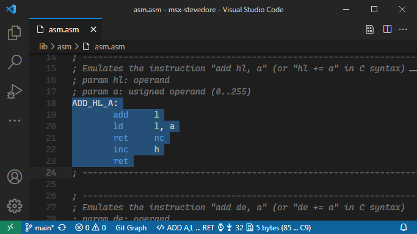
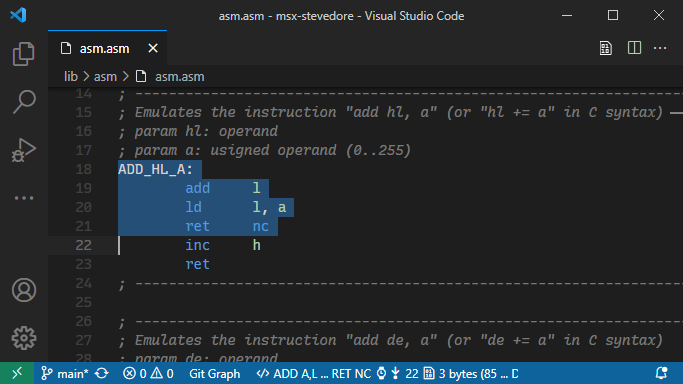
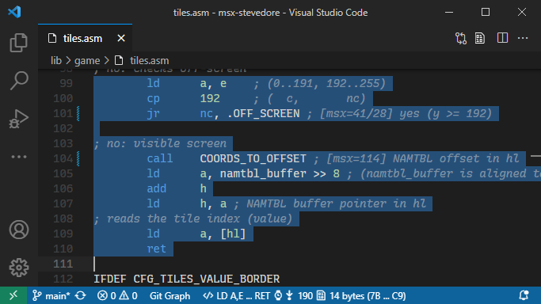

[](https://github.com/theNestruo/z80-asm-meter-vscode/actions)
[](https://www.codefactor.io/repository/github/thenestruo/z80-asm-meter-vscode/overview/master)
[](https://marketplace.visualstudio.com/items?itemName=theNestruo.z80-asm-meter)

# Z80 Assembly meter in Visual Studio Code

The **Z80 Assembly meter** extension for Visual Studio Code meters clock cycles and bytecode size from Z80 assembly source code.

This extension meters timing in Z80 clock periods, referred to as T (time) cycles.

As the MSX standard requires so-called M1 wait cycles, this extension also meters M1 wait cycles for Z80 timing calculations on MSX. For a good explanation on how to do Z80 timing calculations on MSX, please read [Wait States](http://map.grauw.nl/resources/z80instr.php#waits) from Grauw [MSX Assembly Page](http://map.grauw.nl).

In Amstrad CPC architecture, all instruction timings are stretched so that they are all multiples of a microsecond (1&micro;s), which is approximatively equivalent to the duration of a NOP instruction. This extension can meter duration in "number of NOPs" for timing calculations on Amstrad CPC.

ZX Spectrum Next Extended Z80 Instruction Set is supported.

## Features

Select Z80 assembly source code to view clock cycles, mnemonic of the instruction, and/or bytecode size in the status bar. Click on either to copy the clock cycles and the bytecode size information to the clipboard.


<br>_Theme: [Dark-](https://marketplace.visualstudio.com/items?itemName=theNestruo.dark-minus-theme)_

If there is no selection, the current line will be used.

## Recommendations

This extension can be installed standalone, but does not contribute any problem matcher, symbol provider, definition provider, or completion proproser for Z80 assembly.

Therefore, this extension can be installed alongside other Z80-related extensions such as:

* [Z80 Macro-Assembler](https://marketplace.visualstudio.com/items?itemName=mborik.z80-macroasm) by mborik
* [Z80 Assembly](https://marketplace.visualstudio.com/items?itemName=Imanolea.z80-asm) by Imanolea
* [MSX Z80](https://marketplace.visualstudio.com/items?itemName=sharksym.asm-msx) by Yeoungman Seo
* [pasmo](https://marketplace.visualstudio.com/items?itemName=boukichi.pasmo) by BouKiChi
* [DeZog - Z80 Debugger](https://marketplace.visualstudio.com/items?itemName=maziac.dezog) by Maziac
* (and probably others; please check the `z80-asm-meter.languageIds` setting)

## Extension Settings

This extension contributes the following settings:

### Main settings

* `z80-asm-meter.languageIds`: Additional language IDs for which the extension is enabled (such as "c", to meter in-lined assembly). Defaults to: `"asm-collection", "pasmo", "z80", "z80-asm", "z80-macroasm", "zeus-asm"`.

* `z80-asm-meter.platform`: Controls the instruction set to use and the timing information to display:
    * `z80` (default): Uses the default Z80 instruction set and shows default timing information.
    * `msx`: For MSX developers. Uses the default Z80 instruction set and shows Z80+M1 timing information (MSX standard).
    * `pc8000`: For NEC PC-8000 series developers. Uses the default Z80 instruction set and conveniently shows both default Z80 timing and Z80+M1 timing information.
    * `cpc`: For Amstrad CPC developers. Uses the default Z80 instruction set and shows timing measured in number of NOPs.
    * `z80n`: For ZX Spectrum Next developers. Includes the ZX Spectrum Next Extended Z80 instruction set and shows default timing information.

* `z80-asm-meter.viewBytes`: Enables the opcode in the status bar. Disabled by default.

* `z80-asm-meter.viewInstruction`: Enables the processed instruction in the status bar. Useful to check if the extension is mistaking instructions. Enabled by default.

### Assembler syntax related settings

* `z80-asm-meter.sjasmplus`: Enables support for parsing [SjASMPlus](https://github.com/sjasmplus/sjasmplus) [alternative syntax](https://z00m128.github.io/sjasmplus/documentation.html#s_asm_lang) and [fake instructions](https://z00m128.github.io/sjasmplus/documentation.html#s_fake_instructions). Disabled by default.

* `z80-asm-meter.syntax.label`: Adjusts the label detection to match the syntax of the assembler:
    * `default` (default): The labels must be followed by a colon (:) and can be indented. This behaviour matches most assemblers and coding styles.
    * `colonOptional`: The trailing colon is optional, and the labels must not be indented. This behaviour matches some assemblers such as [Pasmo](http://pasmo.speccy.org/) and [SjASMPlus](https://github.com/sjasmplus/sjasmplus).

* `z80-asm-meter.syntax.lineSeparator`: Adjusts the line separator to match the syntax of the assembler:
    * `none` (default): Does not allow multiple instructions on a single line.
    * `colon`: Use colon (`:`) to have more than one instruction on a line.
    * `pipe`: Use pipe (`|`) to have more than one instruction on a line. This behaviour matches some assemblers such as [tniASM](http://www.tni.nl/products/tniasm.html).

* `z80-asm-meter.syntax.repeat`: Enables support for parsing repeat count:
    * `none` (default): Disables repeat count.
    * `brackets`: The repeat count is specified within square brackets (`[` and `]`) before the instruction. This behaviour partially matches the source format of [Sjasm](http://www.xl2s.tk/sjasmman2.html#s3), but multiple repeat counts and iteration count are not supported.
    * `dot`: The repeat count is specified after a dot (`.`) before the instruction. This behaviour partially matches the repeat pseudo-op of [SjASMPlus](https://z00m128.github.io/sjasmplus/documentation.html#s_pseudoops), but multiple repeat counts and expressions are not supported.

### Timing related settings

* `z80-asm-meter.timings.atExit`: When enabled, if the selection ends with a `JP`, `JR` or `RET` operation, measures the timings of any previous conditional `JP`, `JR` or `RET` operation as _not taken_ and, if the last operation is a conditonal operation, measures its timing as _taken_. Therefore, the timings shown will be the best and the worst case scenarios of the code flow up to the selected exit point. See [timing "at exit"](#timing-at-exit).

* `z80-asm-meter.timings.hints`: Enables timing hints, read from the line comment.

    * `none` (default): Disables timing hints.
    * `subroutine`: Subroutine timing hint will be added to `CALL`, `DJNZ`, `JP`, `JR`, `RET` or `RST` instructions only. If the timing hint is a pair of values, both will be added to the current source code block timings. If the instruction is conditional, the timing hint will be added to the _taken_ branch timing only.
    * `any`: Any timing hint will be added. This includes empty (i.e.: no actual source code) lines.

### Macro definitions

* `z80-asm-meter.macros`: An array of [user-defined macros](#macro-definitions):
    * `name`: The name of the macro.
    * `instructions`: The macro definition, as instructions for the macro. Optional.
    * `z80`: Declares or overrides Z80 default macro timing. Optional.
    * `msx`: Declares or overrides Z80+M1 macro timing information (MSX standard). Optional.
    * `cpc`: Declares or overrides macro timing measured in number of NOPs. Optional.
    * `size`: Declares or overrides macro byte count. Optional.

## Advanced usage

### Timing "at exit"

Let's use a routine with two exit points as an example.

With `z80-asm-meter.timings.atExit` disabled (default behaviour), when the entire routine is selected, two timings are shown:


But one of those timings is misleading: 38 clock cycles are considering `ret nc` as _taken_, but there are some instructions in the selected code block that are not be executed if that's the case. There is no execution flow that will take those 38 clock cycles.

When `z80-asm-meter.timings.atExit` is enabled, meterings use a best effort to meter the timings of the actual execution flow of the selected code block. In the example, the `ret nc` conditional instruction is considered as _not taken_ (because it is not the last instruction of the code block), and the selected block is correcly metered as 32 clock cycles:



It is also possible to meter the execution time of other execution flows. When the selection finishes in the `ret nc` exit point, the `ret nc` conditional instruction will be considered as _taken_ (because it is the last instruction of the code block), and the execution path is correcly metered as 22 clock cycles:



### Timing hints

A timing hint follows the pattern: `[z80=27]` or `[msx=32/22]` with the key being `z80` for Z80 timings, `msx` or `m1` for Z80+M1 timings, `cpc` for number of NOPs timings, or `t` or `ts` for the timing to be used regardless the platform. Current platform timing will taken precedence over `t` or `ts` timing hint.

The timing can be either a single value or a pair of values separated by slash (`/`). This is convenient for taking into account different execution paths within the called routine:

* `CALL ADD_HL_A ; [msx=32/22]` will be metered as 50/40 Z80+M1 clock cycles, as the result of adding 18(/18) + 32/22.

* `CALL Z, ADD_HL_A ; [msx=32/22]` will be metered as 50/11 Z80+M1 clock cycles, as the result of adding 18/11 + 32(/0). Please note the second timing hint (22) will be ignored in conditional operations.

For example:



* The timing hint of *COORDS_TO_OFFSET* (144 clock cycles) has been added to the timing of the the `CALL` instruction (18 clock cycles).

* The timing hints of *.OFF_SCREEN* (41/28 clock cycles) have not been taken into account, as [_timing "at exit"_](#timing-at-exit) is enabled and `JR NC` condition is considered _not met_.

    With _timing "at exit"_ disabled, the main timing of *.OFF_SCREEN* (41 clock cycles) would have been added to the timing of the `JR NC` instruction (13/8 clock cycles) when the condition is _met_, resulting in 54/8 clock cycles for this `JR NC` instruction.

Negative timings are supported. This serves very particular use cases, including, but not limited to:

* To specify the timing of the expected runtime instruction in self-modifying code.

* To modify the metered timings when part of the code is to be skipped:

    ```asm
        ; (...)
        jr z, .else
        pop hl  ; abort caller [msx=-100]
    .else:
        ; (...)
        ret     ; [msx=100] timing of the remaining code in the caller
    ```

### User-defined macros

Macro definitions are not read from actual source code. They must provided in user settings in order to be detected and properly metered. Macro definitions can be added to either user settings (`settings.json`) or workspace settings (`.vscode/settings.json`).

As most of the macro definition fields are optional, this extension uses a best-effort to meter a macro with the provided information. But, generally speaking, there are three ways to define a macro:

1. Macro definition with instructions. Macro will be metered by aggregating the metrics of the instructions.

    ```jsonc
    "z80-asm-meter.macros": [
        {
            "name": "ADD_HL_A",
            "instructions": [
                "ADD A, L",
                "LD L, A",
                "JR NC, zz",
                "INC H"
            ]
        }
    ]
    ```

2. Macro definition with timing and size. Macro will be metered using the provided timing and/or size.

    ```jsonc
    "z80-asm-meter.macros": [
        {
            "name": "ADD_HL_A",
            "z80": "24/19", // (note that there is no cpc timing,
            "msx": "28/23", //    so this macro won't be metered
            "size": 5       //    if platform=cpc)
        }
    ]
    ```

3. Macro definition with both instructions and timing and/or size. Provided timing and/or size will override the metrics of the instructions.

    ```jsonc
    "z80-asm-meter.macros": [
        {
            "name": "ADD_HL_A",
            "instructions": [
                "ADD A, L", "LD L, A", "JR NC, zz", "INC H"
            ],
            "msx": "23" // (overrides actual timing for platform=msx)
        }
    ]
    ```

## F.A.Q.

### The status bar does not display any information. I don't get clock cycles and bytecode size!

Double check the `z80-asm-meter.languageIds` setting in your settings.

### My macros are not recognized

Macro definitions are not read from actual source code, but from user settings. Double check the `z80-asm-meter.macros` setting.

### How can I get clock cycles and bytecode size for in-lined assembly in my C files?

Double check the `z80-asm-meter.languageIds` setting in your settings. It has to include `c`:

```json
"z80-asm-meter.languageIds": [ "c" ],
```

### I've added `"z80-asm-meter.languageIds": [ "c", "s", "asm" ]`, but I only get clock cycles for in-lined assembly; now I don't get clock cycles in my assembly files!

The `z80-asm-meter.languageIds` setting uses language IDs, not extensions. Check the language ID of your assembly files and replace `"s"` and `"asm"` with that extension ID. Or use the default language IDs, then add `"c"`:

```json
"z80-asm-meter.languageIds": [ "asm-collection", "pasmo", "z80", "z80-asm", "z80-macroasm", "zeus-asm", "c" ],
```

## Credits

Coded by [**theNestruo**](https://github.com/theNestruo) ([Néstor Sancho](https://twitter.com/NestorSancho)).
* Contributors: [**IIIvan37**](https://github.com/IIIvan37), [**hlide**](https://github.com/hlide), [**Kris Borowinski**](https://github.com/kborowinski), [**alexanderk23**](https://github.com/alexanderk23).
* Inspired by Rafael Jannone [BiT](http://msx.jannone.org/bit/).
* [Z80 Instruction Set](http://map.grauw.nl/resources/z80instr.php) from Grauw [MSX Assembly Page](http://map.grauw.nl).
* Amstrad CPC timing information from [Z80 CPC Timings - Cheat sheet](https://wiki.octoate.de/lib/exe/fetch.php/amstradcpc:z80_cpc_timings_cheat_sheet.20131019.pdf) made by cpcitor/findyway from data at http://www.cpctech.org.uk/docs/instrtim.html.<!-- * Amstrad CPC timing information from [Rasm Z80 assembler](http://www.cpcwiki.eu/forum/programming/rasm-z80-assembler-in-beta/) documentation. -->
* ZX Spectrum Next [Extended Z80 Instruction Set](https://wiki.specnext.dev/Extended_Z80_instruction_set) from [Sinclair ZX Spectrum Next Official Developer Wiki](https://wiki.specnext.dev).
* SDCC syntax from _Z80 Instruction Set_ section from [ASZ80 Assembler](https://shop-pdp.net/ashtml/asz80.htm) documentation.
* SjASMPlus fake instructions from _Fake instructions_ section from [SjASMPlus documentation](https://z00m128.github.io/sjasmplus/documentation.html).
