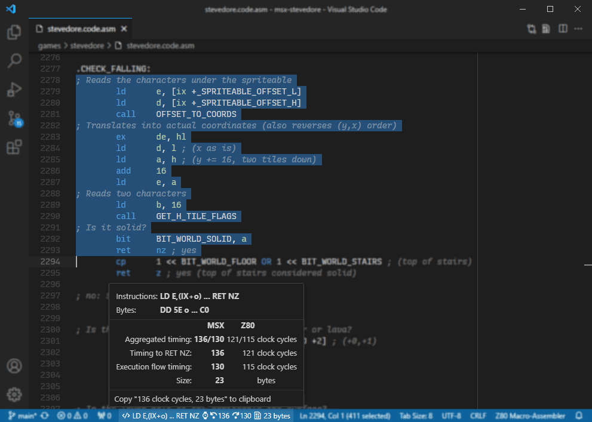
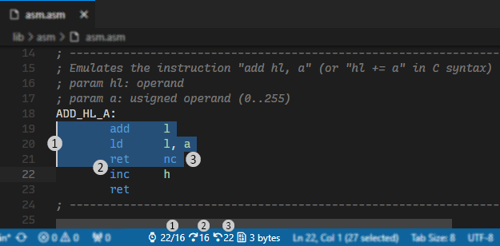
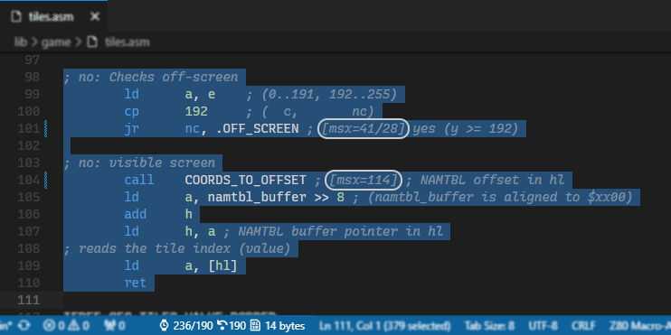

[](https://github.com/theNestruo/z80-asm-meter-vscode/actions)
[](https://www.codefactor.io/repository/github/thenestruo/z80-asm-meter-vscode/overview/master)
[](https://marketplace.visualstudio.com/items?itemName=theNestruo.z80-asm-meter)

# Z80 Assembly meter in Visual Studio Code

The **Z80 Assembly meter** extension for Visual Studio Code meters clock cycles and bytecode size from Z80 assembly source code.

This extension meters timing in Z80 clock periods, referred to as T (time) cycles.


## Index

- [Features](#features)
- [Getting Started](#getting-started)
    - [Main settings](#main-settings)
    - [Status bar settings](#status-bar-settings)
    - [Assembler syntax settings](#assembler-syntax-settings)
    - [Parser settings](#parser-settings)
- [Advanced usage](#advanced-usage)
    - [Total timing calculations](#total-timing-calculations)
    - [Timing hints](#timing-hints)
    - [User-defined macros](#user-defined-macros)
- [Inlay hints (experimental)](#inlay-hints-experimental)
- [Migration to version 5.x](#migration-to-version-5x)
- [Performance and efficiency](#performance-and-efficiency)
- [F.A.Q.](#faq)
- [Credits](#credits)


## Features

Select Z80 assembly source code to view clock cycles, mnemonic of the instruction, and/or bytecode size in the status bar. Click on either to copy the clock cycles and the bytecode size information to the clipboard.


<br>_Theme: [Dark- (Visual Studio) (Flat UI)](https://marketplace.visualstudio.com/items?itemName=theNestruo.dark-minus-theme)_

If there is no selection, the current line will be used.

As the MSX standard requires so-called M1 wait cycles, this extension also meters M1 wait cycles for Z80 timing calculations on MSX. For a good explanation on how to do Z80 timing calculations on MSX, please read [Wait States](http://map.grauw.nl/resources/z80instr.php#waits) from Grauw [MSX Assembly Page](http://map.grauw.nl).

In Amstrad CPC architecture, all instruction timings are stretched so that they are all multiples of a microsecond (1&nbsp;&micro;s), which is approximatively equivalent to the duration of a NOP instruction. This extension can meter duration in "number of NOPs" for timing calculations on Amstrad CPC.

ZX Spectrum Next Extended Z80 Instruction Set is supported.


## Getting started

This extension can be installed standalone, but does not contribute any problem matcher, symbol provider, definition provider, or completion proproser for Z80 assembly.

Therefore, it is recommended to install this extension alongside other Z80-related extensions, such as:

* [Z80 Macro-Assembler](https://marketplace.visualstudio.com/items?itemName=mborik.z80-macroasm) by mborik
* [Z80 Assembly](https://marketplace.visualstudio.com/items?itemName=Imanolea.z80-asm) by Imanolea
* [MSX Z80](https://marketplace.visualstudio.com/items?itemName=sharksym.asm-msx) by Yeoungman Seo
* [pasmo](https://marketplace.visualstudio.com/items?itemName=boukichi.pasmo) by BouKiChi
* [DeZog - Z80 Debugger](https://marketplace.visualstudio.com/items?itemName=maziac.dezog) by Maziac
* (and probably others; please check the [`z80-asm-meter.languageIds` setting](#main-settings))


### Main settings

* [`z80-asm-meter.languageIds`](vscode://settings/z80-asm-meter.languageIds): Additional language IDs for which the extension is enabled (such as "c", to meter in-lined assembly).

    Defaults to: `["asm-collection", "pasmo", "z80", "z80-asm", "z80-macroasm", "zeus-asm"]`.

* [`z80-asm-meter.platform`](vscode://settings/z80-asm-meter.platform): Controls the instruction set to use and the timing information to display:

    * `z80` (default): Uses the default Z80 instruction set and shows default timing information.
    * `msx`: For MSX developers. Uses the default Z80 instruction set and shows Z80+M1 timing information (MSX standard).
    * `pc8000`: For NEC PC-8000 series developers. Uses the default Z80 instruction set and conveniently shows both default Z80 timing and Z80+M1 timing information.
    * `cpc`: For Amstrad CPC developers. Uses the default Z80 instruction set and shows timing measured in number of NOPs.
    * `z80n`: For ZX Spectrum Next developers. Includes the ZX Spectrum Next Extended Z80 instruction set and shows default timing information.

* [`z80-asm-meter.syntax`](vscode://settings/z80-asm-meter.syntax): Adjusts the main syntax of the assembler.

    The main syntax of the assembler changes the default value of particular features (such as syntax of the labels, or support for fake instructions) to best suit one particular assembler. See [assembler syntax settings](#assembler-syntax-settings) for details.

    * `default` (default): Matches most assemblers.
    * `glass`: Matches [Glass Z80 assembler](http://www.grauw.nl/projects/glass/) syntax.
    * `pasmo`: Matches [Pasmo](http://pasmo.speccy.org/) assembler syntax.
    * `sjasm`: Matches [Sjasm](http://www.xl2s.tk/sjasmmanual.html) assembler syntax.
    * `sjasmplus`: Matches [SjASMPlus](https://github.com/sjasmplus/sjasmplus) assembler syntax.
    * `spasm-ng`: Matches [SPASM-ng](https://github.com/alberthdev/spasm-ng) assembler syntax.
    * `tniasm`: Matches [tniASM](http://www.tni.nl/products/tniasm.html) assembler syntax.

* [`z80-asm-meter.expandSelectionToLine`](vscode://settings/z80-asm-meter.expandSelectionToLine): When enabled, expands the selection to cover entire lines, preventing partial line selections to be mistakenly parsed (e.g.: `RET` instead of `RET Z`).

    Enabled by default.


### Status bar settings

These settings allow to fine-tune the information to be shown in the status bar item and its appearance.

<details>
<summary>Status bar alignment settings</summary>

* [`z80-asm-meter.statusBar.alignment`](vscode://settings/z80-asm-meter.statusBar.alignment): Controls the status bar item position:

    * `leftmost`: Leftmost position of the status bar.
    * `left`: Left side of the status bar.
    * `right` (default): Right side of the status bar.
    * `rightmost`: Rightmost position of the status bar.

</details>

<details>
<summary>Status bar information settings</summary>

* [`z80-asm-meter.statusBar.showInstruction`](vscode://settings/z80-asm-meter.statusBar.showInstruction): Shows the processed instruction in the status bar. Useful to check if the extension is mistaking instructions.

    Disabled by default.

* [`z80-asm-meter.statusBar.instructionIcon`](vscode://settings/z80-asm-meter.statusBar.instructionIcon): The icon to identify the instruction in the status bar. Any [product icon](https://code.visualstudio.com/api/references/icons-in-labels), [Unicode character](https://home.unicode.org/), or plaint text can be used.

    Defaults to: `$(code)`.

    

* [`z80-asm-meter.statusBar.timingsIcon`](vscode://settings/z80-asm-meter.statusBar.timingsIcon): The icon to identify the timings in the status bar. Any [product icon](https://code.visualstudio.com/api/references/icons-in-labels), [Unicode character](https://home.unicode.org/), or plaint text can be used.

    Defaults to: `$(watch)`.

    

* [`z80-asm-meter.statusBar.totalTimings`](vscode://settings/z80-asm-meter.statusBar.totalTimings): Shows total timing calculations in the status bar.

    See [Total timing calculations](#total-timing-calculations) for details.

* [`z80-asm-meter.statusBar.totalTimingsOrder`](vscode://settings/z80-asm-meter.statusBar.totalTimingsOrder): Determines the order of the total timing calculations in the status bar when more than one total timing calculation is visible.

    See [Total timing calculations](#total-timing-calculations) for details.

* [`z80-asm-meter.statusBar.sizeIcon`](vscode://settings/z80-asm-meter.statusBar.sizeIcon): The icon to identify the size and the bytes in the status bar. Any [product icon](https://code.visualstudio.com/api/references/icons-in-labels), [Unicode character](https://home.unicode.org/), or plaint text can be used.

    Defaults to: `$(file-binary)`.

    

* [`z80-asm-meter.statusBar.sizeNumericFormat`](vscode://settings/z80-asm-meter.statusBar.sizeNumericFormat): The numerical format of the size in bytes in the status bar.

    * `decimal` (default): Size in bytes as a decimal number.
    * `hexadecimal`: Size in bytes as an hexadecimal number.
    * `both`: Size in bytes as both a decimal and an hexadecimal number.

* [`z80-asm-meter.statusBar.sizeHexadecimalFormat`](vscode://settings/z80-asm-meter.statusBar.sizeHexadecimalFormat): The hexadecimal format for the hexadecimal size in bytes in the status bar.

    * `hash`: Hexadecimal size in bytes in hash format (`#b45d`).
    * `motorola` (default): Hexadecimal size in bytes in Motorola format (`$b45d`).
    * `intel`: Hexadecimal size in bytes in Intel format (`0b45dh`).
    * `intelUppercase`: Hexadecimal size in bytes in Intel format, uppercase suffix (`0b45dH`).
    * `cStyle`: Hexadecimal size in bytes in C-style format (`0xb45d`).
    * `uppercaseHash`: Hexadecimal size in bytes in uppercase, hash format (`#B45D`).
    * `uppercaseMotorola`: Hexadecimal size in bytes in uppercase, Motorola format (`$B45D`).
    * `uppercaseIntel`: Hexadecimal size in bytes in uppercase, Intel format, lowercase suffix (`0B45Dh`).
    * `uppercaseIntelUppercase`: Hexadecimal size in bytes in uppercase, Intel format (`0B45DH`).
    * `uppercaseCStyle`: Hexadecimal size in bytes in uppercase, C-style format (`0xB45D`).

* [`z80-asm-meter.statusBar.sizeSuffix`](vscode://settings/z80-asm-meter.statusBar.sizeSuffix): The suffix for the size in bytes in the status bar. Either a single string (such as `" B"`), or a couple of strings separated by pipe (|) for singular and plural.

    Defaults to `" byte| bytes"`.

* [`z80-asm-meter.statusBar.showBytes`](vscode://settings/z80-asm-meter.statusBar.showBytes): Shows the bytes (opcode) in the status bar.

    Disabled by default.

</details>

<details>
<summary>Status bar behaviour settings</summary>

* [`z80-asm-meter.statusBar.copyTimingsAsHints`](vscode://settings/z80-asm-meter.statusBar.copyTimingsAsHints): Enable copying timings as [timing hints](#timing-hints), instead of the default human-readable format.

    Disabled by default.

* [`z80-asm-meter.statusBar.debounce`](vscode://settings/z80-asm-meter.statusBar.debounce): Milliseconds to prevent metering from being called too frequently when the selection changes.

    Defaults to: `100` (100&nbsp;ms).

* [`z80-asm-meter.statusBar.cacheSize`](vscode://settings/z80-asm-meter.statusBar.cacheSize): Size of the cache, in selections, used to minimize metering calculations when navigating through previously metered code.

    Defaults to: `100` (100 selections).

</details>

### Assembler syntax settings

The [main syntax of the assembler](#main-settings) can be used to best suit one particular assembler. These settings allow to fine-tune the particular features (such as syntax of the labels, or support for fake instructions).

<details>

* [`z80-asm-meter.syntaxFeature.labelColonOptional`](vscode://settings/z80-asm-meter.syntaxFeature.labelColonOptional): Adjusts the label detection to match the syntax of the assembler.

    When disabled, the labels must be followed by a colon (:) and can be indented. This behaviour matches most assemblers and coding styles.

    When enabled, the trailing colon is optional, and the labels must not be indented. This behaviour matches some assemblers such as Pasmo and SjASMPlus.

    Enabled by default when the main syntax of the assembler is set to `pasmo` or `sjasmplus`, disabled by default otherwise.

* [`z80-asm-meter.syntaxFeature.repeat`](vscode://settings/z80-asm-meter.syntaxFeature.repeat): Enables support for parsing repeat count:

    * `none` (default): Disables repeat count.
    * `brackets`: The repeat count is specified within square brackets (`[` and `]`) before the instruction. This behaviour partially matches the [source format](http://www.xl2s.tk/sjasmman2.html#s3) of Sjasm, but multiple repeat counts and iteration count are not supported. This is the default value when the main syntax of the assembler is set to `sjasm`.
    * `dot`: The repeat count is specified after a dot (`.`) before the instruction. This behaviour partially matches the repeat [pseudo-op](https://z00m128.github.io/sjasmplus/documentation.html#s_pseudoops) of SjASMPlus, but multiple repeat counts and expressions are not supported. This is the default value when the main syntax of the assembler is set to `sjasmplus`.

* [`z80-asm-meter.syntaxFeature.lineSeparator`](vscode://settings/z80-asm-meter.syntaxFeature.lineSeparator): Adjusts the line separator to match the syntax of the assembler:
    * `disabled` (default): Does not allow multiple instructions on a single line.
    * `backslash`: Use backslash (`\`) to have more than one instruction on a line. This behaviour matches some assemblers such as SPASM-ng. This is the default value when the main syntax of the assembler is set to `spasm-ng`.
    * `colon`: Use colon (`:`) to have more than one instruction on a line.
    * `pipe`: Use pipe (`|`) to have more than one instruction on a line. This behaviour matches some assemblers such as tniASM. This is the default value when the main syntax of the assembler is set to `tniasm`.

* [`z80-asm-meter.syntaxFeature.fakeInstructions`](vscode://settings/z80-asm-meter.syntaxFeature.fakeInstructions): Enables SjASMPlus [fake instructions](https://z00m128.github.io/sjasmplus/documentation.html#s_fake_instructions) support.

    Enabled by default when the main syntax of the assembler is set to `sjasmplus`, disabled by default otherwise.

* [`z80-asm-meter.syntaxFeature.registerListInstructions`](vscode://settings/z80-asm-meter.syntaxFeature.registerListInstructions): Enables SjASMPlus [register list instructions](https://z00m128.github.io/sjasmplus/documentation.html#s_asm_lang) support.

    Enabled by default when the main syntax of the assembler is set to `sjasmplus`, disabled by default otherwise.

* [`z80-asm-meter.syntaxFeature.negativeConditions`](vscode://settings/z80-asm-meter.syntaxFeature.negativeConditions): Enables Glass [negative conditions](http://www.grauw.nl/projects/glass/)) support.

    Enabled by default when the main syntax of the assembler is set to `glass`, disabled by default otherwise.

* [`z80-asm-meter.syntaxFeature.dupEdup`](vscode://settings/z80-asm-meter.syntaxFeature.dupEdup): Enables `DUP`/`EDUP` repetition blocks.

    Enabled by default when the main syntax of the assembler is set to `sjasmplus`, disabled by default otherwise.

* [`z80-asm-meter.syntaxFeature.reptEndr`](vscode://settings/z80-asm-meter.syntaxFeature.reptEndr): Enables `REPT`/`ENDR` repetition blocks.

    Enabled by default when the main syntax of the assembler is set to `sjasmplus`, disabled by default otherwise.

* [`z80-asm-meter.syntaxFeature.reptEndm`](vscode://settings/z80-asm-meter.syntaxFeature.reptEndm): Enables `REPT`/`ENDM` repetition blocks.

    Enabled by default when the main syntax of the assembler is set to `glass`, disabled by default otherwise.

<br>

As a summary, these are the default values of the assembler syntax settings, based on the value of the main [`z80-asm-meter.syntax` setting](#main-settings):

| Assembler syntax feature   | Default value | `default` | `glass` | `pasmo` | `sjasm`    | `sjasmplus` | `spasm-ng`  | `tniasm` |
| ---                        | :-:           | :-:       | :-:     | :-:     | :-:        | :-:         | :-:         | :-:      |
| `labelColonOptional`       | disabled      | -         | -       | enabled | -          | enabled     | -           | enabled  |
| `repeat`                   | `none`        | -         | -       | -       | `brackets` | `dot`       | -           | -        |
| `lineSeparator`            | `disabled`    | -         | -       | -       | -          | -           | `backslash` | `pipe`   |
| `fakeInstructions`         | disabled      | -         | -       | -       | -          | enabled     | -           | -        |
| `registerListInstructions` | disabled      | -         | -       | -       | -          | enabled     | -           | -        |
| `negativeConditions`       | disabled      | -         | enabled | -       | -          | -           | -           | -        |
| `dupEdup`                  | disabled      | -         | -       | -       | -          | enabled     | -           | -        |
| `reptEndr`                 | disabled      | -         | -       | -       | -          | enabled     | -           | -        |
| `reptEndm`                 | disabled      | -         | enabled | -       | -          | -           | -           | -        |

</details>

### Parser settings

These settings allow to fine-tune the source code parsing and metering.

<details>

* [`z80-asm-meter.parser.directives.defsAsInstructions`](vscode://settings/z80-asm-meter.parser.directives.defsAsInstructions): Tries to parse `DEFS` directive bytes as single byte instructions.

    Disabled by default.

* [`z80-asm-meter.parser.instructionsCacheSize`](vscode://settings/z80-asm-meter.parser.instructionsCacheSize): Size of the internal cache, in instructions, to lighten the metering calculations; particularly when metering large source code blocks.

    Defaults to: `100` (100 instructions).

</details>


## Advanced usage


### Total timing calculations

When the selection covers several lines and encompasses a single subroutine, there are more than one way to calculate the total timing.

<details>
There are three total timing calculation available:



1. **default**: The _default_ total timing calculation mode is the raw addition of the timings of the individual instructions.

2. **execution flow**: When the selection is a single subroutine (i.e.: there are no unconditional `JP`, `JR` or `RET` instructions in the selection), the _execution flow_ total timing calculation measures the timing of the execution flow through the selection (i.e.: to the next, non selected, instruction) by considering any `DJNZ` or conditional `JP`, `JR` or `RET` instruction as _not taken_.

3. **execution flow to the selected exit point**: When the selection is a single subroutine and the selection ends at an exit point (a conditional or unconditional `JP`, `JR` or `RET` instruction) or calls a subroutine (a conditional or unconditional `CALL`), the _execution flow to the selected exit point_ total timing calculation mode measures the timing of the execution flow to the selected exit point, by considering the last instruction as _taken_ if it is a conditional instruction.

</details>

<details>
<summary>Total timing calculations settings</summary>

* [`z80-asm-meter.statusBar.totalTimings`](vscode://settings/z80-asm-meter.statusBar.totalTimings): Shows [total timing calculations](#total-timing-calculations) in the status bar.

    * `all`: Shows all the total timing calculation that apply to the selection.

        

    * `combineAll`: Shows all the total timing calculation that apply to the selection, but combined to reduce the size of the status bar item.

        

    * `smart` (default): Shows total timing calculation that are relevant to the selection.

        

    * `combineSmart`: Shows total timing calculation that are relevant to the selection, but combined to reduce the size of the status bar item.

        

    * `best`: Shows the total timing calculation that best fits the selection.

        

    * `default`: Does not show any alternative total timing calculation.

        

* [`z80-asm-meter.statusBar.totalTimingsOrder`](vscode://settings/z80-asm-meter.statusBar.totalTimingsOrder): Determines the order of the [total timing calculations](#total-timing-calculations) in the status bar when more than one total timing calculation is visible.

    * `retFlowJumpCall` (default): At exit point (returns) first. Execution flow next. Other exit points (jumps and calls) last. This order is the most visual, with returns ("going back") to the left, execution flow ("going down") next, and jumps and calls ("going elsewhere") to the right.

        

    * `flowRetJumpCall`: Execution flow first. Any exit points (returns, jumps and calls) last.

        

    * `retJumpCallFlow`: Any exit point (returns, jumps and calls) first, execution flow last. This order matches the timing convention of single instructions, where the _conditions met_ (returns, jumps and calls) are to the left and the conditions not met (execution flow) are to the right.

        

</details>

<details>
<summary>Execution flow total timing calculation: settings</summary>

* [`z80-asm-meter.timing.executionFlow.enabled`](vscode://settings/z80-asm-meter.timing.executionFlow.enabled): Enables execution flow total timing calculation.

    Enabled by default.

* [`z80-asm-meter.timing.executionFlow.threshold`](vscode://settings/z80-asm-meter.timing.executionFlow.threshold): Minimum number of instructions to be selected for the calculation of execution flow total timing.

    Defaults to: `2` (2 instructions).

* [`z80-asm-meter.timing.executionFlow.requireConditional`](vscode://settings/z80-asm-meter.timing.executionFlow.requireConditional): Requires at least one conditional instruction to enable execution flow total timing calculation.

    Enabled by default.

* [`z80-asm-meter.timing.executionFlow.icon`](vscode://settings/z80-asm-meter.timing.executionFlow.icon): Execution flow total timing calculation icon in the status bar. Any [product icon](https://code.visualstudio.com/api/references/icons-in-labels), [Unicode character](https://home.unicode.org/), or plaint text can be used.

    Defaults to: `$(debug-step-over)`.

    

* [`z80-asm-meter.timing.executionFlow.stopOnUnconditionalJump`](vscode://settings/z80-asm-meter.timing.executionFlow.stopOnUnconditionalJump): Disables execution flow total timing calculation if an unconditional `JP`, `JR` or `RET` instruction is found.

    Enabled by default.

</details>

<details>
<summary>Total timing calculation of the execution flow to the selected exit point: settings</summary>

* [`z80-asm-meter.timing.atExit.retEnabled`](vscode://settings/z80-asm-meter.timing.atExit.retEnabled): Enables total timing calculation of the execution flow to the selected exit point when the selection ends with a `RET`, `RETI` or `RETN` instruction.

    Enabled by default.

* [`z80-asm-meter.timing.atExit.jumpEnabled`](vscode://settings/z80-asm-meter.timing.atExit.jumpEnabled): Enables total timing calculation of the execution flow to the selected exit point when the selection ends with a `DJNZ`, `JP` or `JR` instruction.

    Enabled by default.

* [`z80-asm-meter.timing.atExit.callEnabled`](vscode://settings/z80-asm-meter.timing.atExit.callEnabled): Enables total timing calculation of the execution flow to the selected exit point when the selection ends with a `CALL` or `RST` instruction.

    Disabled by default.

* [`z80-asm-meter.timing.atExit.threshold`](vscode://settings/z80-asm-meter.timing.atExit.threshold): Minimum number of instructions to be selected for the calculation of total timing calculation of the execution flow to the selected exit point.

    Defaults to: `2` (2 instructions).

* [`z80-asm-meter.timing.atExit.requireConditional`](vscode://settings/z80-asm-meter.timing.atExit.requireConditional): Requires at least one conditional instruction to enable total timing calculation of the execution flow to the selected exit point.

    Enabled by default.

* [`z80-asm-meter.timing.atExit.stopOnUnconditionalJump`](vscode://settings/z80-asm-meter.timing.atExit.stopOnUnconditionalJump): Disables total timing calculation of the execution flow to the selected exit point if an unconditional `JP`, `JR` or `RET` instruction is found.

    Enabled by default.

* [`z80-asm-meter.timing.atExit.retIcon`](vscode://settings/z80-asm-meter.timing.atExit.retIcon): Total timing calculation of the execution flow to the selected exit point (`RET`, `RETI` or `RETN` instruction) icon in the status bar. Any [product icon](https://code.visualstudio.com/api/references/icons-in-labels), [Unicode character](https://home.unicode.org/), or plaint text can be used.

    Defaults to: `$(debug-step-back)`.

    

* [`z80-asm-meter.timing.atExit.jumpIcon`](vscode://settings/z80-asm-meter.timing.atExit.jumpIcon): Total timing calculation of the execution flow to the selected exit point (`DJNZ`, `JP` or `JR` instruction) icon in the status bar. Any [product icon](https://code.visualstudio.com/api/references/icons-in-labels), [Unicode character](https://home.unicode.org/), or plaint text can be used.

    Defaults to: `$(debug-step-out)`.

    

* [`z80-asm-meter.timing.atExit.callIcon`](vscode://settings/z80-asm-meter.timing.atExit.callIcon): Total timing calculation of the execution flow to the selected exit point (`CALL` or `RST` instruction) icon in the status bar. Any [product icon](https://code.visualstudio.com/api/references/icons-in-labels), [Unicode character](https://home.unicode.org/), or plaint text can be used.

    Defaults to: `$(debug-step-into)`.

    

</details>


### Timing hints

Timing hints can be used to modify the timing of a particular instruction. The primary use case is to declare the timing of the subroutine being invoked by `CALL` or `JP` instructions.

<details>

A timing hint follows the pattern: `[z80=27]` or `[msx=32/22]` with the key being:

* `z80` for Z80 timings,
* `msx` or `m1` for Z80+M1 timings,
* `cpc` for number of NOPs timings, or
* `t` or `ts` for the timing to be used regardless the platform. Specific platform timing hints will take precedence over `t` or `ts` generic timing hints.

The timing can be either a single value or a pair of values separated by slash (`/`). This is convenient for taking into account different execution paths within the called routine:

* `CALL ADD_HL_A ; [msx=32/22]` will be metered as 50/40 Z80+M1 clock cycles, as the result of adding 18(/18) + 32/22.

* `CALL Z, ADD_HL_A ; [msx=32/22]` will be metered as 50/11 Z80+M1 clock cycles, as the result of adding 18/11 + 32(/0). Please note the second timing hint (22) will be ignored in conditional operations.

For example:



In this example:

* Of the timing hints of *.OFF_SCREEN* (41/28 clock cycles), the 41 has been added to the timing of conditional `JR` instruction when the condition is _taken_ (13 clock cycles). Please note the second timing hint (28) has been ignored, as there is only one possible timing for the _taken_ condition path.

* The timing hint of *COORDS_TO_OFFSET* (144 clock cycles) has been added to the timing of the `CALL` instruction (18 clock cycles).

Negative timings are supported. This may seem unintuitive, but serves very particular use cases including, but not limited to:

* Adjust the timing of an instruction in self-modifying code to match the timing of the replacement instruction.

* Adjust timings when part of the code is to be skipped:

    ```asm
        ; (...)
        jr z, .else
        pop hl  ; [msx=-100] will abort caller
    .else:
        ; (...)
        ret     ; [msx=100] remaining code in the caller
    ```

</details>

<details>
<summary>Timing hints settings</summary>

* [`z80-asm-meter.timing.hints.enabled`](vscode://settings/z80-asm-meter.timing.hints.enabled): Enables [timing hints](#timing-hints), read from the line comment:

    * `none`: Disables timing hints.
    * `subroutine` (default): Subroutine timing hint will be added to `CALL`, `DJNZ`, `JP`, `JR`, `RET` or `RST` instructions only. If the timing hint is a pair of values, both will be added to the current source code block timings. If the instruction is conditional, the timing hint will be added to the _taken_ branch timing only.
    * `any`: Any timing hint found, regardless the instruction. This includes empty (i.e.: no actual source code) lines.
    * `ignoreCommentedOut`: Any timing hint found, regardless the instruction. This includes empty (i.e.: no actual source code) lines, but ignores empty lines that look like commented out source code.

* [`z80-asm-meter.timing.hints.regexps`](vscode://settings/z80-asm-meter.timing.hints.regexps): An array of regexp-based user-defined timing hints. The line comment will be matched agains the regular expression and the timing hint values will be read from this configuration object.

    * `pattern`: The pattern of the regular expression to match against the line comment.
    * `flags`: The string indicating the flags of the regular expression to match against the line comment. Optional.
    * `z80`: Declares or overrides Z80 default timing hint. Optional.
    * `msx`: Declares or overrides Z80+M1 timing hint (MSX standard). Optional.
    * `m1`: Declares or overrides Z80+M1 timing hint. Optional.
    * `cpc`: Declares or overrides timing hint measured in number of NOPs. Optional.
    * `t`: Declares or overrides default timing hint. Optional.
    * `ts`: Declares or overrides default timing hint. Optional.

</details>


### User-defined macros

Macro definitions are not read from actual source code. They must provided in user settings in order to be detected and properly metered.

<details>

Macro definitions can be added to either user settings (`settings.json`) or workspace settings (`.vscode/settings.json`).

As most of the macro definition fields are optional, this extension uses a best-effort to meter a macro with the provided information. But, generally speaking, there are three ways to define a macro:

1. Macro definition with instructions. Macro will be metered by aggregating the metrics of the instructions. For example:

    ```jsonc
    "z80-asm-meter.macros": [
        {
            "name": "ADD_HL_A",
            "instructions": [
                "ADD A, L",
                "LD L, A",
                "JR NC, zz",
                "INC H"
            ]
        }
    ]
    ```

2. Macro definition with timing and size. Macro will be metered using the provided timing and/or size. For example:

    ```jsonc
    "z80-asm-meter.macros": [
        {
            "name": "ADD_HL_A",
            "z80": "24/19", // (note that there is no cpc timing,
            "msx": "28/23", //    so this macro won't be metered
            "size": 5       //    if platform=cpc)
        }
    ]
    ```

3. Macro definition with both instructions and timing and/or size. Provided timing and/or size will override the metrics of the instructions. For example:

    ```jsonc
    "z80-asm-meter.macros": [
        {
            "name": "ADD_HL_A",
            "instructions": [
                "ADD A, L", "LD L, A", "JR NC, zz", "INC H"
            ],
            "msx": "23" // (overrides actual timing for platform=msx)
        }
    ]
    ```

</details>

<details>
<summary>Macros settings</summary>

* [`z80-asm-meter.macros`](vscode://settings/z80-asm-meter.macros): An array of [user-defined macros](#user-defined-macros):
    * `name`: The name of the macro; will be matched against the mnemonic of the source code.
    * `z80`: Declares or overrides Z80 default macro timing. Optional.
    * `msx`: Declares or overrides Z80+M1 macro timing information (MSX standard). Optional.
    * `m1`: Declares or overrides Z80+M1 macro timing information. Optional.
    * `cpc`: Declares or overrides macro timing measured in number of NOPs. Optional.
    * `t`: Declares or overrides default macro timing. Optional.
    * `ts`: Declares or overrides default macro timing. Optional.
    * `size`: Declares or overrides macro byte count. Optional.
    * `instructions`: The macro definition, as instructions. Optional.

</details>


## Inlay hints (experimental)

* [`z80-asm-meter.inlayHints.enabled`](vscode://settings/z80-asm-meter.inlayHints.enabled): Enables detection and metering of subroutines as inlay hints.

    Disabled by default

* (TBD)


## Migration to version 5.x

The _Z80 Assembly meter_ extension started as a simple extension. To support different platforms, assembler syntaxes, macros, fake instructions, repetition blocks, and different total timing calculations, the extension grew and its configuration became cumbersome: some settings affected too many things, some other settings were unintuitive and caused undesired behaviour, etc.

Starting from version 5.0.0, the settings are properly grouped, are more fine grained, their default values make more sense for the majority of the users, and there are more customization options.

If you are migrating from any version prior to 5.x to version 5.x, some of your existing _Z80 Assembly meter_ settings may have been moved or renamed, or may have changed its default value. Please update your settings accordingly by following the deprecation messages.

<details>
<summary>Deprecated settings</summary>

Please find the deprecated settings, the last version where the setting was available, and the replacement setting or settings in the following table:

| Version | Deprecated setting | Replacement setting(s) |
| --: | --- | --- |
| | | |
| v4.3.0 | `z80-asm-meter.viewInstruction` | [`z80-asm-meter.statusBar.showInstruction`](vscode://settings/z80-asm-meter.statusBar.showInstruction) |
| v4.3.0 | `z80-asm-meter.timing.mode` | [`z80-asm-meter.statusBar.totalTimings`](vscode://settings/z80-asm-meter.statusBar.totalTimings) |
| v4.3.0 | `z80-asm-meter.viewBytes` | [`z80-asm-meter.statusBar.showBytes`](vscode://settings/z80-asm-meter.statusBar.showBytes) |
| v4.3.0 | `z80-asm-meter.debounce` | [`z80-asm-meter.statusBar.debounce`](vscode://settings/z80-asm-meter.statusBar.debounce) |
| v4.3.0 | `z80-asm-meter.syntax.label` | `z80-asm-meter.syntax.label.colonOptional` |
| v4.3.0 | `z80-asm-meter.directivesAsInstructions` | [`z80-asm-meter.parser.directives.defsAsInstructions`](vscode://settings/z80-asm-meter.parser.directives.defsAsInstructions) |
| v4.3.0 | `z80-asm-meter.timing.threshold` | [`z80-asm-meter.timing.executionFlow.threshold`](vscode://settings/z80-asm-meter.timing.executionFlow.threshold)<br>[`z80-asm-meter.timing.atExit.threshold`](vscode://settings/z80-asm-meter.timing.atExit.threshold) |
| v4.3.0 | `z80-asm-meter.timing.hints` | [`z80-asm-meter.timing.hints.enabled`](vscode://settings/z80-asm-meter.timing.hints.enabled) |
| | | |
| v5.1.0 | `z80-asm-meter.statusBar.compactSize` | [`z80-asm-meter.statusBar.sizeSuffix`](vscode://settings/z80-asm-meter.statusBar.sizeSuffix) |
| v5.1.0 | `z80-asm-meter.timing.atExit.enabled` | [`z80-asm-meter.timing.atExit.retEnabled`](vscode://settings/z80-asm-meter.timing.atExit.retEnabled)<br>[`z80-asm-meter.timing.atExit.jumpEnabled`](vscode://settings/z80-asm-meter.timing.atExit.jumpEnabled)<br>[`z80-asm-meter.timing.atExit.callEnabled`](vscode://settings/z80-asm-meter.timing.atExit.callEnabled) |
| v5.1.0 | `z80-asm-meter.timing.atExit.icon` | [`z80-asm-meter.timing.atExit.jumpIcon`](vscode://settings/z80-asm-meter.timing.atExit.jumpIcon)<br>[`z80-asm-meter.timing.atExit.callIcon`](vscode://settings/z80-asm-meter.timing.atExit.callIcon) |
| | | |
| v5.3.0 | `z80-asm-meter.syntax.label.colonOptional` | [`z80-asm-meter.syntaxFeature.labelColonOptional`](vscode://settings/z80-asm-meter.syntaxFeature.labelColonOptional) |
| v5.3.0 | `z80-asm-meter.syntax.repeat` | [`z80-asm-meter.syntaxFeature.repeat`](vscode://settings/z80-asm-meter.syntaxFeature.repeat) |
| v5.3.0 | `z80-asm-meter.syntax.lineSeparator` | [`z80-asm-meter.syntaxFeature.lineSeparator`](vscode://settings/z80-asm-meter.syntaxFeature.lineSeparator) |
| v5.3.0 | `z80-asm-meter.syntax.enable.fakeInstructions` | [`z80-asm-meter.syntaxFeature.fakeInstructions`](vscode://settings/z80-asm-meter.syntaxFeature.fakeInstructions) |
| v5.3.0 | `z80-asm-meter.syntax.enable.registerListInstructions` | [`z80-asm-meter.syntaxFeature.registerListInstructions`](vscode://settings/z80-asm-meter.syntaxFeature.registerListInstructions) |
| v5.3.0 | `z80-asm-meter.syntax.enable.negativeConditions` | [`z80-asm-meter.syntaxFeature.negativeConditions`](vscode://settings/z80-asm-meter.syntaxFeature.negativeConditions) |
| v5.3.0 | `z80-asm-meter.syntax.enable.dupEdup` | [`z80-asm-meter.syntaxFeature.dupEdup`](vscode://settings/z80-asm-meter.syntaxFeature.dupEdup) |
| v5.3.0 | `z80-asm-meter.syntax.enable.reptEndr` | [`z80-asm-meter.syntaxFeature.reptEndr`](vscode://settings/z80-asm-meter.syntaxFeature.reptEndr) |
| v5.3.0 | `z80-asm-meter.syntax.enable.reptEndm` | [`z80-asm-meter.syntaxFeature.reptEndm`](vscode://settings/z80-asm-meter.syntaxFeature.reptEndm) |
| | | |

</details>


## Performance and efficiency

Users are encouraged to update to the newer versions for a more performant and efficient source code metering.

<details>

Early versions of this extension avoided metering more than once the same selection, and also prevented the metering to be triggered too frequently (debouncing).

From version 5.4.0 onwards, development has focused on performance improvements: now it uses a "Least Recently Used" (LRU) cache for previously metered selections, expensive RegExps have been replaced by lighter alternatives, and another internal LRU cache for instructions improves the performance when metering large source code blocks.

The following table compares the time took to meter 11&nbsp;179 lines of source code (the [fully annotated disassembly of King's Valley (&copy; Konami 1985)](https://github.com/GuillianSeed/Kings-Valley) by [Manuel Pazos](https://github.com/GuillianSeed)) using VS Code 1.92.1, Windows 10, AMD Ryzen 3 2200U:

| Version | [`z80-asm-meter.parser.instructionsCacheSize`](vscode://settings/z80-asm-meter.parser.instructionsCacheSize) | Time |
| :-: | :-- | --: |
| 5.3.5 | (not available) | 4&nbsp;149&nbsp;ms |
| 5.4.0 | (not available) | 3&nbsp;795&nbsp;ms |
| 5.5.0<br>5.5.1 | `100` (default value) | 398&nbsp;ms |
| 5.5.2 | `100` (default value) | 242&nbsp;ms |
| 5.5.2 | `500` | 202&nbsp;ms |
| 5.6.0 (preview) | `100` (default value) | 252&nbsp;ms |

</details>


## F.A.Q.


### Q: The status bar does not display any information. I don't get clock cycles and bytecode size!

Double check the [`z80-asm-meter.languageIds`](vscode://settings/z80-asm-meter.languageIds) setting in your settings.


### Q: My macros are not recognized.

Macro definitions are not read from actual source code, but from user settings. Double check the [`z80-asm-meter.macros` setting](#user-defined-macros).


### Q: How can I get clock cycles and bytecode size for in-lined assembly in my C files?

Double check the [`z80-asm-meter.languageIds`](vscode://settings/z80-asm-meter.languageIds) setting in your settings. It has to include `c`:

```json
"z80-asm-meter.languageIds": [ "c" ]
```


### Q: I've added `"z80-asm-meter.languageIds": [ "c", "s", "asm" ]`, but I only get clock cycles for in-lined assembly; now I don't get clock cycles in my assembly files!

The [`z80-asm-meter.languageIds`](vscode://settings/z80-asm-meter.languageIds) setting uses language IDs, not extensions. Check the language ID of your assembly files and replace `"s"` and `"asm"` with that extension ID. Or use the default language IDs, then add `"c"`:

```json
"z80-asm-meter.languageIds": [ "asm-collection", "pasmo", "z80", "z80-asm", "z80-macroasm", "zeus-asm", "c" ]
```


### Q: &lt;some feature&gt; stopped working after updating the extension.

Double check your settings for any [deprecated setting](#migration-to-version-5x) that needs to be replaced.


### Q: But that is your fault! You should support the deprecated settings for a few versions!

VS Code API support for deprecated settings does conflict with default values. I did my best to keep the extension backwards compatible, but it ended up being a hard-to-debug mess that failed most of the times.

From version 5.0.0 onwards I'll keep the [deprecated setting](#migration-to-version-5x) section updated.


### Q: The extension is too confusing; there are too many things in the status bar now.

There are new features, such as [total timing calculations](#total-timing-calculations) and [timing hints](#timing-hints), that are now enabled by default. The default values should be appropriate for the majority of the users, but if you are uncomfortable with the new features, or find them confusing, you can still disable them.

The shortest way to disable the new features is:

```json
"z80-asm-meter.statusBar.totalTimings": "default",
"z80-asm-meter.timing.hints.enabled": "disabled"
```


### Q: The extension does not follow the VS Code [UX Guidelines](https://code.visualstudio.com/api/ux-guidelines/overview) given for the [Status Bar](https://code.visualstudio.com/api/ux-guidelines/status-bar).

The main issue is that, when using the default configuration, the extension uses more than one icon.

It is possible to use text instead of icons via configuration settings:

```json
"z80-asm-meter.statusBar.timingsIcon": "$(watch) Ts ",
"z80-asm-meter.statusBar.sizeIcon": ", Sz ",
"z80-asm-meter.timing.executionFlow.icon": "↓", // UNICODE Downwards Arrow (U+2193)
"z80-asm-meter.timing.atExit.retIcon": "←",     // UNICODE Leftwards Arrow (U+2190)
"z80-asm-meter.timing.atExit.jumpIcon": "→",    // UNICODE Rightwards Arrow (U+2192)
"z80-asm-meter.timing.atExit.callIcon": "→",    // UNICODE Rightwards Arrow (U+2192)
```


Or, when showing the processed instruction in the status bar:

```json
"z80-asm-meter.statusBar.showInstruction": true,
"z80-asm-meter.statusBar.instructionIcon": "$(watch)",
"z80-asm-meter.statusBar.timingsIcon": "Ts ",
"z80-asm-meter.statusBar.sizeIcon": ", Sz ",
"z80-asm-meter.timing.executionFlow.icon": "↓", // UNICODE Downwards Arrow (U+2193)
"z80-asm-meter.timing.atExit.retIcon": "←",     // UNICODE Leftwards Arrow (U+2190)
"z80-asm-meter.timing.atExit.jumpIcon": "→",    // UNICODE Rightwards Arrow (U+2192)
"z80-asm-meter.timing.atExit.callIcon": "→",    // UNICODE Rightwards Arrow (U+2192)
```


## Credits

Coded by [**theNestruo**](https://github.com/theNestruo) (Néstor Sancho).
* Contributors: [**IIIvan37**](https://github.com/IIIvan37), [**hlide**](https://github.com/hlide), [**Kris Borowinski**](https://github.com/kborowinski), [**alexanderk23**](https://github.com/alexanderk23), [**RenaudLottiaux**](https://github.com/RenaudLottiaux)
* Inspired by Rafael Jannone [BiT](http://msx.jannone.org/bit/).
* [Z80 Instruction Set](http://map.grauw.nl/resources/z80instr.php) from Grauw [MSX Assembly Page](http://map.grauw.nl).
* Amstrad CPC timing information from [Z80 CPC Timings - Cheat sheet](https://wiki.octoate.de/lib/exe/fetch.php/amstradcpc:z80_cpc_timings_cheat_sheet.20131019.pdf) made by cpcitor/findyway from data at http://www.cpctech.org.uk/docs/instrtim.html.<!-- * Amstrad CPC timing information from [Rasm Z80 assembler](http://www.cpcwiki.eu/forum/programming/rasm-z80-assembler-in-beta/) documentation. -->
* ZX Spectrum Next [Extended Z80 Instruction Set](https://wiki.specnext.dev/Extended_Z80_instruction_set) from [Sinclair ZX Spectrum Next Official Developer Wiki](https://wiki.specnext.dev).
* SDCC syntax from _Z80 Instruction Set_ section from [ASZ80 Assembler](https://shop-pdp.net/ashtml/asz80.htm) documentation.
* SjASMPlus fake instructions from _Fake instructions_ section from [SjASMPlus documentation](https://z00m128.github.io/sjasmplus/documentation.html).
* Glass Z80 assembler syntax from _Directives_ and _Release notes_ sections from [Glass Z80 assembler](http://www.grauw.nl/projects/glass/).
